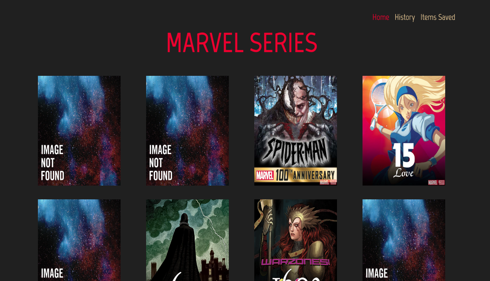
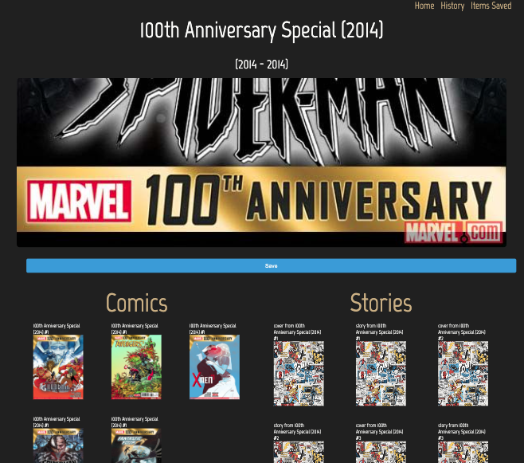
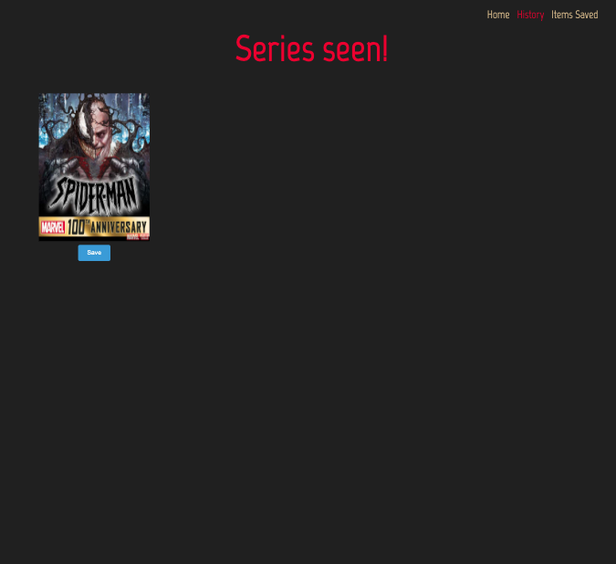
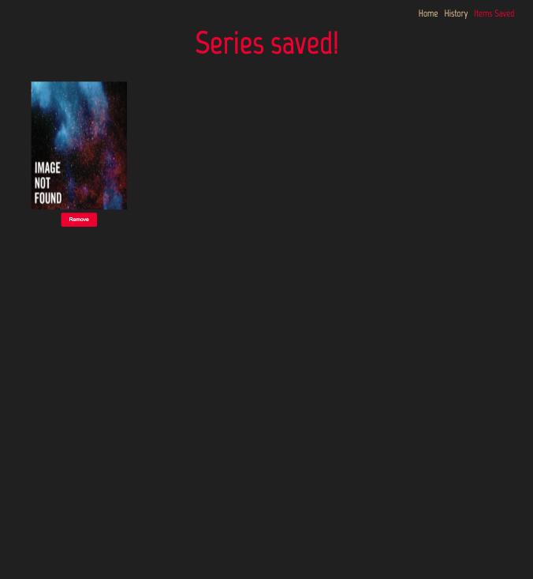

## Acknowledgements

- [Live project](https://tipti.netlify.app/)

# Tipti Challenge

This will render the series properly and its content according to the endpoints suggested

|         Home         |         Detail         |
| :------------------: | :--------------------: |
|  |  |

|         History         |         Saved         |
| :---------------------: | :-------------------: |
|  |  |

This project is mobile friendly!

Thir project is based on SFC
Single File Component architecture

This project uses:

- Vue3
- SASS
- Typescript

## Environment Variables

To run this project, you will need to add the following environment variables to your .env file

`VITE_API_URL`=https://gateway.marvel.com/v1/public

`VITE_PUBLIC_KEY`=4eeb3d4b7ff9d593756a3e3dd32bddc4
`VITE_PRIVATE_KEY`=29ff19ff3a517abb1bc0292c28380dedcc6708b3

## Run Locally

Clone the project

```bash
  git clone git@github.com:lualreye/tipti.git
```

Install dependencies

```bash
  npm install
```

Run project

```bash
  npm run dev
```
